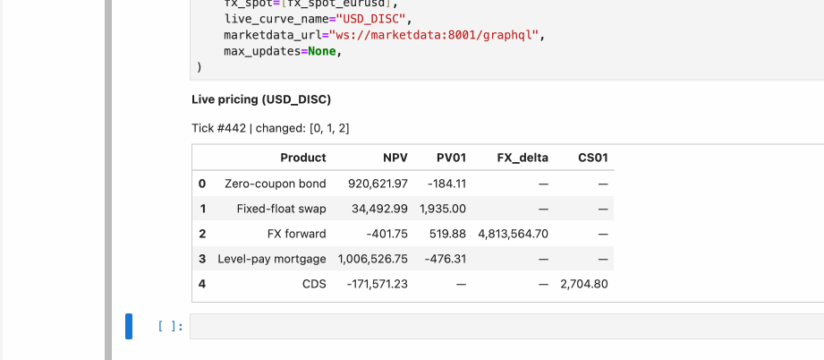
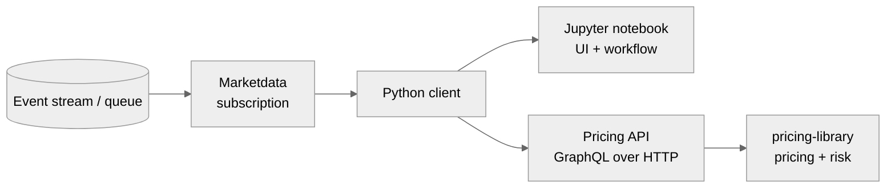

# Industrial Valuation & Risk Platform (Python)

## Executive summary

This repository contains a **pricing and risk library in Python** plus a **microservices distribution layer** designed for enterprise quant usage:

- **`pricing-library/`** is the deterministic compute core (products, curves, market snapshots, pricing dispatch, and finite-difference risk).
- **`api/`** exposes pricing and risk via a **stateless GraphQL API** that can scale horizontally (multiple replicas behind a load balancer).
- **`marketdata/`** distributes curves via GraphQL (query + subscription) backed by an event stream (Redis Streams in the demo).
- **`client/`** provides a notebook-friendly Python client (HTTP for pricing, WebSocket for subscriptions).
- **`jupyter/demo.ipynb`** demonstrates **real-time repricing and risk** on market ticks.

Primary coverage by asset class (the library targets valuation + common risk across **Rates, FX, Credit, and Mortgages**).

Business coverage in the current slice (and intentional simplifications):

| Product | Market (asset class) | Business use case | What is implemented here (simplified by design) | Notes |
|---|---|---|---|---|
| Zero-coupon bond | Rates | discounting, curve sanity checks | continuous-compounding curve discounting | [`docs/BOND.md`](docs/BOND.md), [`docs/VALIDATION.md`](docs/VALIDATION.md) |
| Fixed-float swap | Rates | core rates hedging / pricing | single-curve swap with provided payment times | [`docs/SWAP.md`](docs/SWAP.md) |
| FX forward | FX | hedging FX cashflows | covered interest parity (CIP) using base/quote discount curves; PV in quote currency | [`docs/FX_FORWARD.md`](docs/FX_FORWARD.md) |
| Level-pay mortgage | Mortgages | amortizing cashflows example | deterministic annuity-style cashflows (no prepayment / optionality model) | [`docs/MORTGAGE.md`](docs/MORTGAGE.md) |
| CDS (single-name) | Credit | credit protection pricing | simplified single-name CDS with exogenous hazard curve inputs; CS01 via parallel hazard bump | [`docs/CDS.md`](docs/CDS.md) |

These simplifications are intentional: the goal is to demonstrate **correct methodology, clean interfaces, and enterprise scaling patterns** rather than full market conventions and model completeness.

What this README focuses on:

- design decisions that matter to quants in an enterprise setting (scaling, correctness, extensibility)
- how to run and use the system (library-only or full stack)
- modelling assumptions and constraints (scope boundaries are explicit)

---

## 1. How to use it

### 1.1 Run the full stack (recommended)

From repo root:

```bash
docker compose up --build --scale api-backend=3
```

Endpoints (local):

- Pricing API (Traefik): `http://localhost:8000/graphql` (health: `http://localhost:8000/health`)
- Marketdata: `http://localhost:8001/graphql` (health: `http://localhost:8001/health`)
- JupyterLab: `http://localhost:8888` (opens `jupyter/demo.ipynb`)

In Jupyter, run the notebook cells. The last section streams curve ticks and recomputes **NPV + PV01** in real-time. The live blotter updates as USD_DISC curve ticks arrive:



If you want to call the API from a script (outside the notebook), the client package provides a thin wrapper:

```python
from pricing_client import PricingClient, CurveInput, MarketInput, ZeroCouponBondInput

client = PricingClient("http://localhost:8000/graphql")

curve = CurveInput(
    name="USD_DISC",
    pillars=[0.5, 1.0, 2.0, 5.0, 10.0],
    zero_rates_cc=[0.045, 0.043, 0.040, 0.038, 0.037],
)
market = MarketInput(curves=[curve])
bond = ZeroCouponBondInput(curve="USD_DISC", maturity=2.0, notional=1_000_000)

result = client.price_zero_coupon_bond(bond, market, calculate_pv01=True)
print(result.npv, result.pv01)
```

Security note: the Jupyter container is configured for local demo convenience (no auth). Do not expose it publicly.

### 1.2 Library-only usage (in-process)

```bash
cd pricing-library
poetry install
poetry run pytest -q
```

Example pricing + PV01:

```python
from pricing.curves import ZeroRateCurve
from pricing.market import Market
from pricing.products.bond import ZeroCouponBond
from pricing.pricing import price
from pricing.risk import pv01_parallel

curve = ZeroRateCurve(
    name="USD_DISC",
    pillars=[0.5, 1.0, 2.0, 5.0, 10.0],
    zero_rates_cc=[0.045, 0.043, 0.040, 0.038, 0.037],
)
market = Market(curves={"USD_DISC": curve})

bond = ZeroCouponBond(curve="USD_DISC", maturity=2.0, notional=1_000_000)
npv = price(bond, market)
pv01 = pv01_parallel(bond, market, curve_name="USD_DISC", bump_bp=1.0)
print(npv, pv01)
```

---

## 2. What is implemented (scope)

### 2.1 Products and risk measures

| Instrument | Valuation output | Risk measures implemented |
|---|---|---|
| Zero-coupon bond | NPV | PV01 (parallel curve bump) |
| Fixed-float swap (single-curve) | NPV | PV01 (parallel curve bump) |
| FX forward (CIP) | NPV (quote ccy) | PV01 (curve bump), FX delta (spot bump) |
| Level-pay mortgage | NPV | PV01 (parallel curve bump) |
| CDS (single-name, simplified) | NPV | CS01 (hazard curve bump) |

### 2.2 Supporting documentation (per product)

| Topic | Link |
|---|---|
| Validation and formula mapping | [`docs/VALIDATION.md`](docs/VALIDATION.md) |
| Bond notes | [`docs/BOND.md`](docs/BOND.md) |
| Swap notes | [`docs/SWAP.md`](docs/SWAP.md) |
| FX forward notes | [`docs/FX_FORWARD.md`](docs/FX_FORWARD.md) |
| Mortgage notes | [`docs/MORTGAGE.md`](docs/MORTGAGE.md) |
| CDS notes | [`docs/CDS.md`](docs/CDS.md) |

### 2.3 Non-goals (explicit constraints)

This project is not attempting to be a full production rates/credit library. Out of scope by design:

- day-count conventions, calendars, schedule generation, stubs
- curve building / bootstrapping from real market instruments
- advanced model stacks (multi-curve, optionalities, Monte Carlo, xVA)
- enterprise security and governance (authz, entitlements, persistence/audit)

---

## 3. System architecture (enterprise distribution)

### 3.1 High-level components

```mermaid
%%{init: {'theme':'neutral'}}%%
flowchart LR
  U[Users\nnotebooks, apps, batch] --> LB[Load balancer\nTraefik]

  subgraph PricingTier[Pricing tier (horizontal scale)]
    API1[Pricing API replica]
    API2[Pricing API replica]
    API3[Pricing API replica]
  end

  subgraph Core[Compute core]
    LIB["pricing-library\npricing + risk"]
  end

  subgraph MarketTier[Marketdata tier]
    MQ[(Event stream / message queue\nRedis Streams in demo)]
    MD[Marketdata service\nGraphQL query + subscription]
  end

  LB --> API1
  LB --> API2
  LB --> API3

  API1 --> LIB
  API2 --> LIB
  API3 --> LIB

  MQ --> MD
```

### 3.2 How this scales (horizontal replicas)

The key scaling choice is **stateless pricing compute**:

- Pricing API instances do not hold user state and can be replicated horizontally.
- A load balancer routes requests to any replica.
- Market updates are streamed via the marketdata service; users subscribe without polling.

This model supports many concurrent users without requiring shared notebook kernels or shared in-process global state.

---

## 4. Real-time pricing and risk (high-level flow)

The real-time demo shows a common enterprise pattern: **stream market changes**, then **recompute** price and risk on demand.



In the demo notebook:

- a background feed publishes curve updates into the event stream (Redis Streams)
- the client subscribes to curve updates (WebSocket GraphQL subscription)
- on each tick, the notebook requests NPV + PV01 from the pricing API

---

## 5. Pricing library design (extensibility and correctness)

### 5.1 Design principles

- **Data-only products**: instruments contain contract terms only; pricing logic is in pricers.
- **Explicit market snapshot**: valuation inputs are a single `Market` object (curves + FX), suitable for bump/scenario construction.
- **Open/Closed extension**: add new pricers and instruments without modifying engine dispatch.
- **Traceable correctness**: formulas and modelling choices are documented and tested.

### 5.2 Extension points (how the library scales with complexity)

- Curves are defined by a small protocol (discount factor + bump), enabling alternative curve implementations without inheritance coupling.
- Pricers are registered in a `PricingEngine` registry for dispatch.
- Risk measures are implemented via bump-and-reprice (PV01 / FX delta / CS01) with reusable, testable components.

For a minimal extensibility example, see `pricing-library/tests/test_extensibility.py`.

---

## 6. Correctness, tests, assumptions

### 6.1 Correctness and validation

- Mapping to standard formulas and demo checks: [`docs/VALIDATION.md`](docs/VALIDATION.md)
- Product-specific notes (cashflows, conventions, risk): see Section 2.2 links

### 6.2 Tests

- Library tests: `pricing-library/tests/` (pricing identities, risk bumps, and extensibility seams)
- API tests: `api/tests/` (GraphQL pricing queries)

### 6.3 Modelling assumptions (explicit)

- time is represented as **year fractions**
- curve rates are **continuously compounded**
- swap pricing uses a **single curve** (forwards implied from discount factors)
- FX forward uses **covered interest parity (CIP)** and reports PV in **quote currency**
- risk measures are computed via **finite differences** (bump-and-reprice)

---

## 7. API design (contract evolution and global usage)

The pricing interface is GraphQL to support a multi-instrument platform that must evolve safely:

- typed inputs for trades and market snapshots
- request batching (NPV + multiple risk measures in one round-trip)
- additive schema evolution (add fields/measures without breaking clients)

The design is intended for global usage: deploy multiple stateless replicas close to users, and keep market distribution separate from compute.

---

## 8. Repository layout

| Path | Purpose |
|---|---|
| `pricing-library/` | deterministic valuation + risk library |
| `api/` | pricing/risk GraphQL API (stateless, horizontally scalable) |
| `marketdata/` | curve query + subscription (event stream backed in demo) |
| `client/` | Python client (HTTP + WS) |
| `jupyter/` | demo notebook and environment |
| `docs/` | validation + product documentation |
