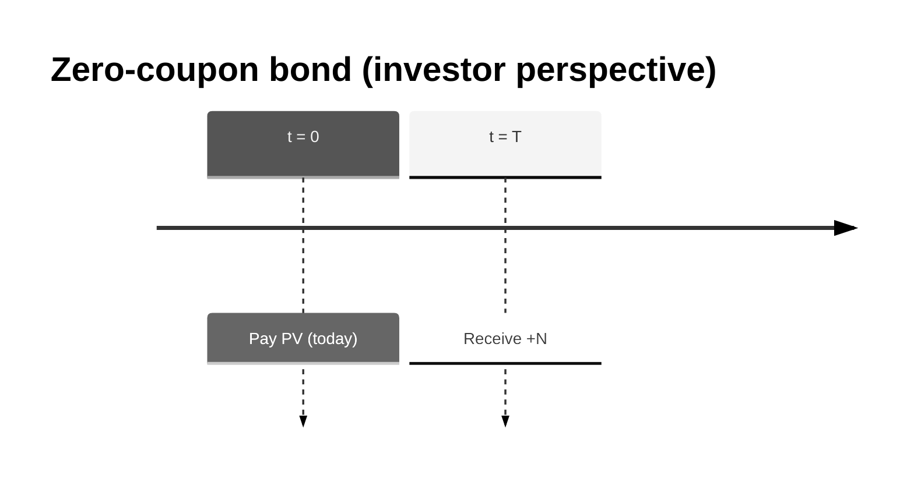

# Zero-Coupon Bond (ZCB): Concept, Valuation, Risk, and Implementation

This document explains the Zero-Coupon Bond conceptually, how valuation and risk are calculated in this project, and how to use the library to compute PV and PV01.

---

## 1. What is a zero-coupon bond? (Business intuition)

A **zero-coupon bond (ZCB)** is the simplest “lend money” contract:

- You pay a price today (the bond price, or present value).
- You receive a single repayment—the **notional** \(N\)—at maturity \(T\).
- There are **no coupons** in between.

**Who uses it**

- **Investors** use it to lock a return with no reinvestment risk from coupons.
- **Treasury/funding** teams use it as a building block for borrowing/lending.
- **Quants** use it as the purest instrument for discounting intuition: one cashflow, one discount factor.

**Key business idea:** The bond price today equals the present value of the maturity cashflow. The discount factor captures time value of money.

---

## 2. Cashflows (timeline)

- At \(t = 0\): you pay the price (PV).
- At \(t = T\): you receive \(+N\).



---

## 3. Valuation (step-by-step)

### 3.1 Inputs

You need:

- A **discount curve** \(DF(t)\) — time value of money (continuously compounded zero rates in this library).

In this library, the curve is a **ZeroRateCurve** with \(DF(t) = e^{-r(t)\,t}\), where \(r(t)\) is the continuously compounded zero rate at time \(t\).

### 3.2 Present value formula

**What is the cashflow?** You receive \(N\) at maturity \(T\). There is only one future cashflow.

**How do we value it?** We discount it to today using the discount factor \(DF(T)\):

\[
PV = N \times DF(T) = N \times e^{-r(T)\,T}
\]

**Why \(DF(T)\)?** The discount factor answers: “How much is \$1 received at time \(T\) worth today?” With continuously compounded rate \(r(T)\), \$1 at \(T\) is worth \(e^{-r(T)\,T}\) today.

**Worked example.** Suppose:
- Notional \(N = 1{,}000{,}000\)
- Maturity \(T = 2.0\) years
- Continuously compounded zero rate at 2Y: \(r(2) = 4.00\%\)

Then:
\[
DF(2) = e^{-0.04 \times 2} = e^{-0.08} \approx 0.923116
\]
\[
PV \approx 1{,}000{,}000 \times 0.923116 = 923{,}116
\]

| Term | Meaning |
|------|---------|
| \(N\) | Notional (single cashflow at maturity) |
| \(DF(T)\) | Discount factor from today to maturity \(T\) |
| \(r(T)\) | Continuously compounded zero rate at \(T\) |

---

## 4. Interest rate risk: PV01

### 4.1 Definition

**PV01** answers: “If I bump the entire curve up by 1 basis point (parallel), how does PV change?”

- Bump: add \(0.0001\) to every zero rate.
- **PV01 = PV(bumped) − PV(base)**

### 4.2 Interpretation

For a ZCB, when rates go up, the discount factor goes down, so PV goes down. Therefore PV01 is **negative**.

**Approximation:** With \(PV = N\,e^{-rT}\), we have \(\frac{dPV}{dr} = -T \times PV\). For a +1 bp bump (\(\Delta r = 0.0001\)):
\[
PV01 \approx (-T \times PV) \times 0.0001
\]

For the example above (\(T=2\), \(PV \approx 923{,}116\)): \(PV01 \approx -2 \times 923{,}116 \times 0.0001 \approx -184.6\).

---

## 5. Implementation in this project

### 5.1 Components

| Component | Location | Role |
|-----------|----------|------|
| **ZeroCouponBond** | `pricing/products/bond.py` | Data-only instrument (curve, maturity, notional) |
| **BondPricer** | `pricing/pricers/bond_pricer.py` | PV = notional × DF(maturity), registered in `PricingEngine` |
| **PV01Parallel** | `pricing/risk/pv01.py` | Bump-and-reprice curve sensitivity |

### 5.2 Market setup

A ZCB needs one discount curve in `Market.curves`, referenced by the bond’s `curve` field.

### 5.3 Implementation snippet (how PV is calculated)

From `pricing/pricers/bond_pricer.py`:

```python
def npv(self, instrument: Instrument, market: Market) -> float:
    """Zero-coupon bond: PV = notional * DF(maturity)."""
    assert isinstance(instrument, ZeroCouponBond)
    bond = instrument
    c = market.curve(bond.curve)
    return bond.notional * c.df(bond.maturity)
```

**PV01 (bump-and-reprice)** from `pricing/risk/pv01.py`:

```python
def compute(self, instrument: Instrument, market: Market) -> float:
    """PV(bumped) - PV(base) for parallel curve shift."""
    bump = self.bump_bp / 10000.0
    curve = market.curve(self.curve_name)
    bumped_curve = curve.bumped(bump)
    bumped_market = market.with_curve(self.curve_name, bumped_curve)
    return price(instrument, bumped_market) - price(instrument, market)
```

---

## 6. Library usage (code examples)

### 6.1 PV and PV01 with the pricing library

```python
from pricing import Market, ZeroCouponBond, ZeroRateCurve, price, pv01_parallel

usd_curve = ZeroRateCurve(
    name="USD_DISC",
    pillars=[0.5, 1.0, 2.0, 5.0, 10.0],
    zero_rates_cc=[0.045, 0.043, 0.040, 0.038, 0.037],
)
market = Market(curves={"USD_DISC": usd_curve})

zcb = ZeroCouponBond(curve="USD_DISC", maturity=2.0, notional=1_000_000)

pv = price(zcb, market)
pv01 = pv01_parallel(zcb, market, curve_name="USD_DISC", bump_bp=1.0)

print(f"NPV:  {pv:,.2f}")
print(f"PV01: {pv01:,.2f}")
```

### 6.2 Composable risk measure (PV01Parallel)

```python
from pricing import PV01Parallel

measure = PV01Parallel(curve_name="USD_DISC", bump_bp=1.0)
pv01_val = measure.compute(zcb, market)

print(measure.name)   # "PV01_USD_DISC"
print(pv01_val)       # same as pv01_parallel(...)
```

### 6.3 Via the API client (Jupyter / scripts)

```python
from pricing_client import CurveInput, MarketInput, PricingClient, ZeroCouponBondInput

client = PricingClient("http://api:8000/graphql")

curve = CurveInput(
    name="USD_DISC",
    pillars=[0.5, 1.0, 2.0, 5.0, 10.0],
    zero_rates_cc=[0.045, 0.043, 0.040, 0.038, 0.037],
)
market = MarketInput(curves=[curve])

bond = ZeroCouponBondInput(curve="USD_DISC", maturity=2.0, notional=1_000_000)

result = client.price_zero_coupon_bond(bond, market, calculate_pv01=True)
print(f"NPV:  {result.npv:,.2f}")
print(f"PV01: {result.pv01:,.2f}")
```

---

## 7. Demo output (reference)

With the demo market (USD_DISC curve) and a 2Y 1M notional ZCB:

- **NPV** ≈ 923,116
- **PV01** ≈ −185 (negative: rates up ⇒ PV down)

Run `poetry run python -m pricing.demo` from the pricing-library directory to reproduce.

---

## 8. Simplifications vs production

| Aspect | This library | Production systems |
|--------|--------------|--------------------|
| Coupons | None (zero-coupon only) | Coupon-bearing bonds |
| Credit | Implicit in curve | Separate credit spread / survival curves |
| Day-count | Year-fractions only | ACT/360, 30/360, etc. |
| Compounding | Continuous | Various (annual, semi-annual, etc.) |

The implementation is minimal and pedagogical; it illustrates the core discounting mechanic.
