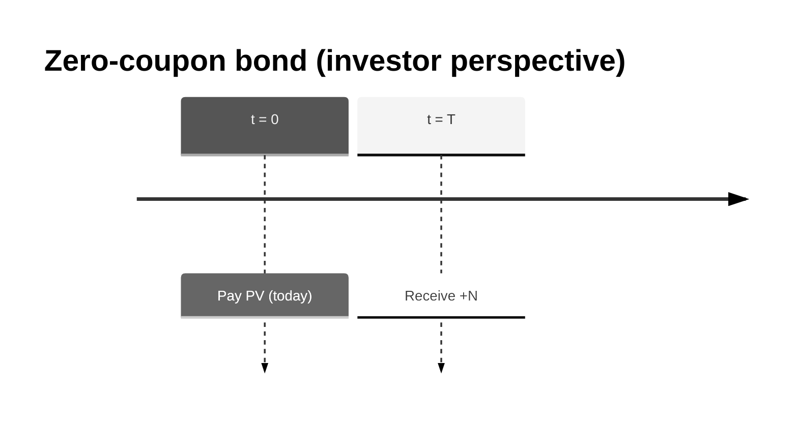
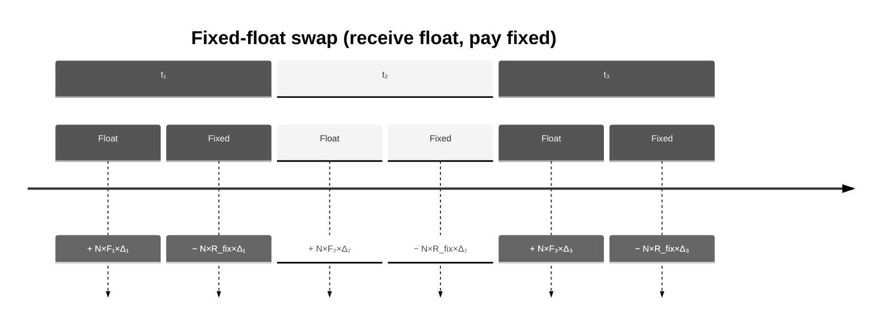
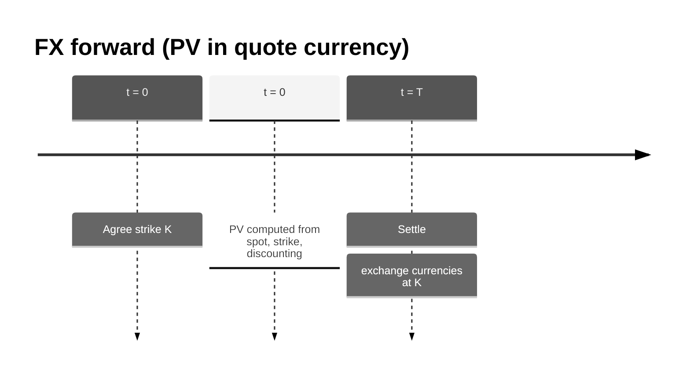
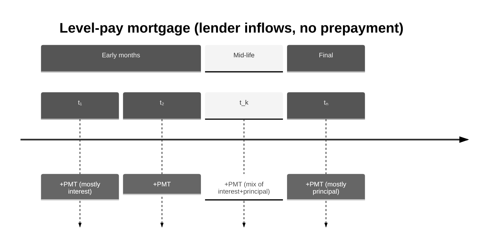

# Business Products (Business-First Guide): Rates, FX, Credit, Mortgages

This document is a **business-first handbook** for the products in this repo. The goal is to make the reader understand:

- **What the product is** and why someone trades/uses it
- **What the cashflows are** (who pays what, when)
- **How valuation works** in plain steps
- **What “risk” means** for the product (what moves its PV and how we measure that)

This repo is intentionally a simplified teaching library: it focuses on the core mechanics of discounting and bump-based risk.

**Contents:** [0. Shared building blocks](#0-shared-building-blocks) · [1. Rates](#1-rates) · [2. FX](#2-fx) · [3. Credit](#3-credit) · [4. Mortgages](#4-mortgages) · [Summary](#summary)

---

## 0. Shared building blocks

### 0.1 Present Value (PV) in one sentence

**Present Value** is “how much future cashflows are worth today,” given a **discount rate** (time value of money).

If you receive a cashflow \(C\) at time \(T\), then:

\[
PV = C \times DF(T)
\]

Where **DF** is a discount factor between today and \(T\).

### 0.2 The curve model used in this repo (and what it implies)

This repo uses a **continuously compounded zero-rate curve** with:

- **Pillars**: a list of maturities in year-fractions (e.g. \([0.5, 1, 2, 5, 10]\))
- **Zero rates (cc)**: the continuously compounded zero rates at those pillars
- **Interpolation**: linear interpolation in the **zero rate** space

In code you see:

- `pillars`: times \(t\) in years
- `zero_rates_cc`: \(r(t)\) values (continuously compounded)

The discount factor is:

\[
DF(t) = e^{-r(t)\,t}
\]

**Important simplifications vs real desks:**

- **Single-curve world for rates**: the swap floating leg uses the same curve that discounts (no separate forward curve).
- **No calendars/day-count conventions**: time is already a year-fraction.
- **No stochastics**: no volatility, no optionality (except mortgage optionality is discussed but not modeled).
- **Linear interpolation**: simple and transparent.

### 0.3 A tiny discounting example (so the numbers feel real)

Suppose:

- Notional \(N = 1{,}000{,}000\)
- Maturity \(T = 2.0\) years
- Continuously compounded zero rate at 2Y: \(r(2) = 4.00\%\)

Then:

\[
DF(2) = e^{-0.04 \times 2} = e^{-0.08} \approx 0.923116
\]

So receiving \(1{,}000{,}000\) in 2 years is worth about:

\[
PV \approx 1{,}000{,}000 \times 0.923116 = 923{,}116
\]

### 0.4 What “risk” means here: PV01 and FX delta

In trading, “risk” is usually framed as: **if the market moves a bit, how much does PV change?**

This repo includes two teaching-friendly risk measures:

#### PV01 (parallel curve bump)

**PV01** answers: “If I bump the entire curve up by 1 basis point, how does PV change?”

Definition used by this repo (exactly):

- Bump: \(+1\) bp means add \(0.0001\) to every `zero_rates_cc`
- **PV01 = PV(bumped) − PV(base)**

So:

- If your trade **loses value when rates go up**, PV01 will be **negative**.
- If your trade **gains value when rates go up**, PV01 will be **positive**.

This “signed PV01” is common and very useful (it tells you direction). Some desks report absolute DV01 magnitude; here we keep the sign.

#### FX delta (spot sensitivity)

**FX delta** answers: “If the FX spot moves a tiny amount, how much does PV change per 1 unit of spot?”

Definition used by this repo:

- Spot bumped multiplicatively: \(S \rightarrow S(1+\text{bump\_pct})\)
- **FX delta = \(\dfrac{PV(bumped) - PV(base)}{S_{bumped} - S}\)**

This is essentially a finite-difference approximation of \(\dfrac{dPV}{dS}\).

### 0.5 How to do this with the library (end-to-end mini example)

Below is the minimal “shape” of using this repo: build a curve, create a `Market`, create a trade, then call `price(...)` and the appropriate risk helper.

```python
from pricing import (
    FXForward,
    FixedFloatSwap,
    LevelPayMortgage,
    Market,
    ZeroCouponBond,
    ZeroRateCurve,
    fx_delta,
    price,
    pv01_parallel,
)

# 1) Create a discount curve (times in year-fractions, zero rates continuously compounded)
usd_curve = ZeroRateCurve(
    name="USD_DISC",
    pillars=[0.5, 1.0, 2.0, 5.0, 10.0],
    zero_rates_cc=[0.045, 0.043, 0.040, 0.038, 0.037],
)

# 2) Create a market snapshot (curves + FX spots as needed)
market = Market(
    curves={"USD_DISC": usd_curve},
    fx_spot={"EURUSD": 1.08},
)

# 3) Define a trade and compute PV + risk
zcb = ZeroCouponBond(curve="USD_DISC", maturity=2.0, notional=1_000_000)
pv = price(zcb, market)
pv01 = pv01_parallel(zcb, market, curve_name="USD_DISC", bump_bp=1.0)

print("ZCB PV:", pv)
print("ZCB PV01 (+1bp):", pv01)
```

---

## 1. Rates

Rates products are about exchanging money across time in the **same currency**, so the primary market driver is the **interest-rate curve**.

The library supports:

- **Zero-coupon bond (ZCB)**
- **Fixed-float interest rate swap (single-curve)**

### 1.1 Zero-coupon bond (ZCB)

#### What it is (business intuition)

A zero-coupon bond is the simplest “lend money” contract:

- You pay some price today (the bond price).
- You receive a single repayment (the **notional**) at maturity.

There are **no coupons** in between.

**Why it exists / who uses it**

- **Investors** use it to lock a return with no reinvestment risk from coupons.
- **Treasury/funding** teams use it as a simple borrowing/lending building block.
- **Quants** use it as the purest instrument for discounting intuition: it is “one cashflow, one discount factor.”

#### Cashflows (timeline)

If you hold a ZCB with notional \(N\) and maturity \(T\):

- At \(t=0\): you pay the price (PV)
- At \(t=T\): you receive \(+N\)



#### Valuation (step-by-step)

1. Get the discount factor \(DF(T)\) from the curve.
2. Multiply by the maturity cashflow \(N\).

\[
PV = N \times DF(T) = N \times e^{-r(T)T}
\]

#### Worked example

Using the example from the shared section:

- \(N=1{,}000{,}000\)
- \(T=2\)
- \(r(2)=4\%\)

\[
PV \approx 923{,}116
\]

#### How to do this with the library (ZCB PV + PV01)

```python
from pricing import Market, ZeroCouponBond, ZeroRateCurve, price, pv01_parallel

usd_curve = ZeroRateCurve(
    name="USD_DISC",
    pillars=[0.5, 1.0, 2.0, 5.0, 10.0],
    zero_rates_cc=[0.045, 0.043, 0.040, 0.038, 0.037],
)
market = Market(curves={"USD_DISC": usd_curve})

zcb = ZeroCouponBond(curve="USD_DISC", maturity=2.0, notional=1_000_000)
pv = price(zcb, market)
pv01 = pv01_parallel(zcb, market, curve_name="USD_DISC", bump_bp=1.0)

print("ZCB PV:", pv)
print("ZCB PV01 (+1bp):", pv01)  # PV(bumped) - PV(base)
```

#### Risk: what makes the PV move?

The PV is mainly driven by **interest rates** (the discount curve). When rates go up, discount factors go down, so PV goes down.

##### PV01 intuition

In continuous compounding, if you hold \(PV = N e^{-rT}\), then:

\[
\frac{dPV}{dr} = -T \times PV
\]

A +1bp move is \(\Delta r = 0.0001\), so a first-order approximation is:

\[
PV01 \approx (-T \times PV)\times 0.0001
\]

For the example:

- \(T=2\)
- \(PV\approx 923{,}116\)

\[
PV01 \approx -2 \times 923{,}116 \times 0.0001 \approx -184.6
\]

Meaning: if you bump the curve up by 1bp, PV drops by about \(185\) (in currency units).

---

### 1.2 Fixed-float interest rate swap (single-curve)

#### What it is (business intuition)

A **plain vanilla interest rate swap** exchanges:

- A **fixed rate** payment stream
- For a **floating rate** payment stream

Same notional, same currency, over a schedule (e.g. quarterly/semiannual).

**Common business uses**

- **Hedging**: convert fixed-rate debt into floating, or floating assets into fixed.
- **Trading**: express a view on the level of rates or the shape of the curve.
- **Asset/liability management**: manage duration of a balance sheet.

#### Cashflows (timeline)

At each payment date \(t_i\):

- Fixed leg cashflow: \(N \times R_{fix} \times \Delta_i\)
- Float leg cashflow: \(N \times F_i \times \Delta_i\)

Where \(\Delta_i\) is the accrual fraction for the period.



#### Valuation in this repo (step-by-step)

This repo uses a **single curve** both to:

- Build forwards for the floating leg, and
- Discount both legs

1. For each payment date \(t_i\), compute \(DF(t_i)\) from the curve.
2. Compute the implied forward rate for each period:

\[
F_i = \frac{\frac{DF(t_{i-1})}{DF(t_i)} - 1}{\Delta_i}
\]

3. Compute each leg’s PV by discounting each cashflow:

\[
PV_{fixed} = \sum_i N \times R_{fix} \times \Delta_i \times DF(t_i)
\]

\[
PV_{float} = \sum_i N \times F_i \times \Delta_i \times DF(t_i)
\]

4. Swap PV depends on direction. In “receive float, pay fixed”:

\[
PV = PV_{float} - PV_{fixed}
\]

#### A key identity (why swaps are “near par”)

Because of how \(F_i\) is defined from discount factors, the floating leg telescopes:

\[
N \times F_i \times \Delta_i \times DF(t_i)
= N \times \left(\frac{DF(t_{i-1})}{DF(t_i)} - 1\right) \times DF(t_i)
= N \times (DF(t_{i-1}) - DF(t_i))
\]

So:

\[
PV_{float} = N \times \sum_i (DF(t_{i-1}) - DF(t_i)) = N \times (DF(0) - DF(T))
\]

In this repo \(DF(0)\approx 1\), so:

\[
PV_{float} \approx N \times (1 - DF(T))
\]

This is why the fixed rate can be chosen so that the swap starts at PV \(\approx 0\).

#### Par swap rate (business definition)

The **par swap rate** is the fixed rate \(R_{par}\) that makes PV zero at inception:

\[
R_{par} = \frac{PV_{float}}{N \sum_i \Delta_i DF(t_i)} = \frac{1-DF(T)}{\sum_i \Delta_i DF(t_i)}
\]

If a client receives a fixed rate **above** \(R_{par}\), the swap has **positive PV** to them (they’re receiving “too much fixed” relative to the curve).

#### Worked par-rate example (with real numbers)

Assume a flat continuously compounded curve at \(r=4.00\%\), with semiannual payments out to \(T=2\) years:

- Pay times: \(t=\{0.5, 1.0, 1.5, 2.0\}\)
- Accruals: \(\Delta_i = 0.5\)

Compute discount factors:

- \(DF(0.5)=e^{-0.04\times 0.5}\approx 0.980199\)
- \(DF(1.0)=e^{-0.04\times 1.0}\approx 0.960789\)
- \(DF(1.5)=e^{-0.04\times 1.5}\approx 0.941765\)
- \(DF(2.0)=e^{-0.04\times 2.0}\approx 0.923116\)

Then:

\[
\sum_i \Delta_i DF(t_i) \approx 0.5 \times (0.980199 + 0.960789 + 0.941765 + 0.923116) \approx 1.902934
\]

\[
1 - DF(2.0) \approx 0.076884
\]

So the par fixed rate is:

\[
R_{par} \approx \frac{0.076884}{1.902934} \approx 0.040404 \; \text{(about 4.0404\%)}
\]

**Interpretation:** if the market (the curve) implies the fair fixed rate is ~4.0404%, then a swap struck at 4.00% is *slightly favorable* to the fixed-rate payer (they pay below fair).

#### Worked PV and PV01 example (signed)

Using the same setup, take:

- Notional \(N = 10{,}000{,}000\)
- Direction: **receive float, pay fixed**
- Fixed rate \(R_{fix} = 4.00\%\)

At \(r=4.00\%\):

- \(PV_{float} \approx N(1-DF(T)) \approx 10{,}000{,}000 \times 0.076884 = 768{,}840\)
- \(PV_{fixed} \approx N R_{fix} \sum \Delta DF \approx 10{,}000{,}000 \times 0.04 \times 1.902934 = 761{,}174\)
- \(PV \approx 768{,}840 - 761{,}174 = 7{,}666\) (positive)

Now bump the curve up by +1bp to \(r=4.01\%\) (illustrative “parallel bump”):

- Discount factors fall slightly, so \(1-DF(T)\) rises slightly
- In this particular structure, the swap PV increases

Numerically (approx), the bumped PV becomes \(\approx 9{,}600\), so:

\[
PV01 \approx 9{,}600 - 7{,}666 \approx +1{,}900
\]

So **PV01 = PV(bumped) − PV(base)** is **positive** here.

#### How to do this with the library (swap PV + PV01)

```python
from pricing import FixedFloatSwap, Market, ZeroRateCurve, price, pv01_parallel

usd_curve = ZeroRateCurve(
    name="USD_DISC",
    pillars=[0.5, 1.0, 2.0, 5.0],
    zero_rates_cc=[0.040, 0.040, 0.040, 0.040],  # flat 4% (cc) for teaching
)
market = Market(curves={"USD_DISC": usd_curve})

swap = FixedFloatSwap(
    curve="USD_DISC",
    notional=10_000_000,
    fixed_rate=0.04,
    pay_times=[0.5, 1.0, 1.5, 2.0],  # semiannual out to 2Y
)

pv = price(swap, market)
pv01 = pv01_parallel(swap, market, curve_name="USD_DISC", bump_bp=1.0)

print("Swap PV:", pv)
print("Swap PV01 (+1bp):", pv01)
```

#### Risk: what makes the PV move?

- **Primary driver**: the curve level (rates up/down).
- **Secondary drivers in real life** (not modeled): multiple curves (OIS vs IBOR), credit/funding adjustments, collateral terms, day-count conventions.

##### PV01 for swaps (interpretation)

PV01 here is **the PV change for a +1bp parallel bump** of the curve:

- A swap that behaves like “long duration” will have **negative PV01** (PV down when rates up).
- A swap that behaves like “short duration” will have **positive PV01** (PV up when rates up).

Direction depends on whether you are net receiver or payer of fixed.

---

### 1.3 Library usage (rates)

The business concepts above map to code like:

- Define a curve (`ZeroRateCurve`) and a market snapshot (`Market`)
- Define a trade (`ZeroCouponBond` or `FixedFloatSwap`)
- Compute PV via `price(...)`
- Compute PV01 via `pv01_parallel(...)` (signed change for +1bp)

See `pricing/demo.py` for a runnable end-to-end example.

---

## 2. FX

FX products are about exchanging cashflows across **two currencies**. The key drivers are:

- **FX spot** (the price of one currency in another)
- **Interest rates / discounting** (in at least one currency)

The library supports:

- **FX forward**

### 2.1 FX forward

#### What it is (business intuition)

An **FX forward** locks in an exchange rate today for a currency exchange in the future.

Example business story:

- A company expects to receive **EUR** in 1 year, but reports in **USD**.
- They want to remove the risk of EURUSD moving.
- They enter an FX forward to **sell EUR and buy USD** at a fixed strike \(K\).

#### Conventions used here (base/quote)

We use a standard market quote convention:

- Pair `"EURUSD"` means **USD per 1 EUR**
- **Base currency**: EUR
- **Quote currency**: USD

So:

- Spot \(S\) and strike \(K\) are both in **USD/EUR**
- Notional \(N_{base}\) is in **EUR**
- PV is expressed in **quote currency** (USD)

#### Cashflows at maturity

At maturity \(T\), the forward payoff in quote currency (USD) is:

\[
Payoff_T = N_{base} \times (S_T - K)
\]

If \(S_T > K\), receiving USD at strike is favorable for someone long the payoff \((S_T-K)\).



#### Valuation in this repo (step-by-step)

This repo uses a simplified “discounted spot difference” approach:

1. Read today’s spot \(S\) from `Market.fx_spot`.
2. Read the quote-currency discount factor \(DF_{quote}(T)\) from the quote curve.
3. Compute:

\[
PV = N_{base} \times DF_{quote}(T) \times (S - K)
\]

**Note:** In a full production model, an FX forward is usually priced using **interest-rate parity** (two curves, funding/collateral) to compute a forward rate \(F\). This repo intentionally keeps it minimal and transparent.

#### Worked example

Assume:

- Pair EURUSD
- \(N_{base} = 5{,}000{,}000\) EUR
- \(S = 1.0800\) USD/EUR
- \(K = 1.0850\) USD/EUR
- \(T = 1\) year
- Quote curve discount factor \(DF_{USD}(1)=0.96\) (illustrative)

Then:

\[
PV = 5{,}000{,}000 \times 0.96 \times (1.08 - 1.085)
= 5{,}000{,}000 \times 0.96 \times (-0.005)
= -24{,}000
\]

Interpreting the sign: in this setup, the forward is “out of the money” (strike above spot), so PV is negative in USD.

#### How to do this with the library (FX forward PV + FX delta + PV01)

```python
from pricing import FXForward, Market, ZeroRateCurve, fx_delta, price, pv01_parallel

usd_curve = ZeroRateCurve(
    name="USD_DISC",
    pillars=[0.5, 1.0, 2.0],
    zero_rates_cc=[0.040, 0.038, 0.035],
)
market = Market(
    curves={"USD_DISC": usd_curve},
    fx_spot={"EURUSD": 1.08},
)

fwd = FXForward(
    pair="EURUSD",
    quote_curve="USD_DISC",
    maturity=1.0,
    notional_base=5_000_000,  # EUR
    strike=1.085,  # USD per EUR
)

pv = price(fwd, market)  # PV in quote currency (USD)
delta = fx_delta(fwd, market, pair="EURUSD", bump_pct=0.01)  # dPV/dSpot (USD per (USD/EUR))
pv01 = pv01_parallel(fwd, market, curve_name="USD_DISC", bump_bp=1.0)  # quote curve bump

print("FXFwd PV (USD):", pv)
print("FXFwd FX delta:", delta)
print("FXFwd PV01 (+1bp USD curve):", pv01)
```

#### Risk: what makes the PV move?

##### FX delta (spot sensitivity)

From the formula:

\[
PV = N_{base} \times DF_{quote}(T) \times (S - K)
\]

So:

\[
\frac{dPV}{dS} = N_{base} \times DF_{quote}(T)
\]

That’s exactly what the repo’s `fx_delta(...)` estimates with a small bump.

Business meaning:

- If you want to hedge the FX-forward’s spot risk, delta tells you “how much USD PV changes per +1 USD/EUR move.”

##### PV01 (quote curve sensitivity)

If USD rates go up, \(DF_{USD}(T)\) goes down, so PV moves too.

The repo’s `pv01_parallel(...)` can be applied to an FX forward by bumping the **quote curve**.

---

## 3. Credit (conceptual, not implemented yet)

Credit products are about the risk that a borrower **defaults**. Even if you keep the interest-rate curve fixed, credit risk can move PV materially.

The typical “hello world” credit instrument is the **Credit Default Swap (CDS)**.

### 3.1 CDS: what it is (business intuition)

A CDS is an insurance-like contract on default of a reference entity:

- **Protection buyer** pays a periodic premium (the CDS spread \(S\)) until maturity or default.
- **Protection seller** pays a default-contingent amount if default happens: \((1 - R)\times N\), where \(R\) is recovery.

Used for:

- Hedging bond/loan exposure
- Trading views on credit quality
- Pricing / transferring default risk

### 3.2 Valuation (conceptual)

You need:

- A **discount curve** \(DF(t)\)
- A **credit curve** such as survival probabilities \(Q(t)=P(\tau>t)\) or hazard rates
- A **recovery rate** \(R\)

Then:

- **Premium leg PV** (you only pay premiums if the entity survives):

\[
PV_{prem} = \sum_i N \times S \times \Delta_i \times DF(t_i) \times Q(t_i)
\]

- **Protection leg PV** (you receive payment on default):

\[
PV_{prot} \approx (1-R)\times N \times \sum_i DF(t_i)\times (Q(t_{i-1}) - Q(t_i))
\]

- CDS PV for the protection buyer is typically:

\[
PV = PV_{prot} - PV_{prem}
\]

### 3.3 Credit risk measures (what desks care about)

- **CS01**: PV change for +1bp move in credit spreads (credit curve bump).
- **Jump-to-default (JTD)**: loss if the name defaults instantly (large discrete move).
- **Recovery sensitivity**: PV change if assumed \(R\) changes.
- **IR PV01**: even credit products still have rate risk via discounting.

**Status in this repo:** CDS and credit curves are planned but not implemented.

---

## 4. Mortgages

Mortgages are loans secured by property. Compared to plain bonds, mortgages have two additional features that matter in practice:

- **Amortization**: the outstanding balance declines over time.
- **Borrower option (prepayment)**: many mortgages can be prepaid/refinanced, which changes cashflows when rates move.

This repo supports a **level-pay mortgage without prepayment** (teaching version).

### 4.1 Level-pay mortgage: what it is (business intuition)

A level-pay (fixed-rate) mortgage has:

- Fixed interest rate (e.g. 6% per year)
- Regular payments (e.g. monthly)
- Same payment amount every period (the “level payment”)
- Each payment contains **interest + principal**
  - Early on: mostly interest
  - Later on: mostly principal

Why businesses care:

- **Banks/lenders** value the mortgage to understand asset value and rate sensitivity.
- **Borrowers** care about the payment amount and total interest paid over life.

### 4.2 Amortization math (how the payment is set)

Let:

- Principal \(P\) (the initial notional)
- Annual mortgage rate \(r_{ann}\)
- Payments per year \(m\) (12 for monthly)
- Periodic rate \(r = \frac{r_{ann}}{m}\)
- Number of payments \(n = \text{term\_years}\times m\)

The level payment \(PMT\) is:

\[
PMT = \frac{P \times r}{1 - (1+r)^{-n}}
\]

#### Worked payment example (numbers)

Assume:

- \(P = 500{,}000\)
- \(r_{ann} = 6\%\)
- Monthly payments: \(m=12\)
- Term: 5 years \(\Rightarrow n=60\)
- \(r = 0.06/12 = 0.005\)

Then:

\[
PMT \approx \frac{500{,}000 \times 0.005}{1 - (1.005)^{-60}} \approx 9{,}666 \quad \text{(approx)}
\]

Now split the first payment into interest/principal:

- Interest (month 1): \(500{,}000 \times 0.005 = 2{,}500\)
- Principal (month 1): \(9{,}666 - 2{,}500 \approx 7{,}166\)
- New balance: \(500{,}000 - 7{,}166 \approx 492{,}834\)

Month 2 interest is slightly smaller because the balance dropped:

- Interest (month 2): \(492{,}834 \times 0.005 \approx 2{,}464\)
- Principal (month 2): \(9{,}666 - 2{,}464 \approx 7{,}202\)

This “interest down, principal up” pattern continues until the balance reaches ~0 at maturity.

### 4.3 Valuation (lender perspective) in this repo

From a lender’s point of view (asset):

- You receive the level payment each period.
- Value today is the sum of each payment discounted by the curve.

If payment times are \(t_1,\dots,t_n\) in years, then:

\[
PV = \sum_{i=1}^{n} PMT \times DF(t_i)
\]

**Important modeling note:** the mortgage **contract rate** uses periodic compounding (monthly), while the discount curve uses **continuous compounding**. In the real world, these conventions are reconciled carefully. Here we keep it simple and accept small “at-par” mismatches in teaching tests.

#### Cashflow chart



### 4.4 Mortgage risk (what desks talk about)

For the level-pay (no-prepay) teaching version:

- **IR PV01**: PV change when the discount curve shifts (+1bp parallel bump).

In real mortgage/MBS markets (not modeled here), the key additional concept is **prepayment**:

- When rates fall, borrowers refinance/prepay.
- The investor gets principal back earlier, losing future high coupons.
- This creates **negative convexity** (a hallmark of mortgages/MBS).

Common real-world risk/valuation terms you’ll hear:

- **CPR/PSA**: prepayment models/assumptions
- **WAL (weighted average life)**: average time to principal return
- **OAS (option-adjusted spread)**: spread after accounting for prepayment option

**Status in this repo:** prepayment and MBS/CMO structures are discussed for learning but not implemented.

### 4.5 Library usage (mortgages)

In code the level-pay mortgage is:

- `LevelPayMortgage(notional, annual_rate, term_years, payments_per_year, curve=...)`
- PV is `price(mortgage, market)`
- IR PV01 is `pv01_parallel(mortgage, market, curve_name)`

See `pricing/demo.py` and `tests/test_mortgage.py` for concrete parameter choices.

#### How to do this with the library (mortgage PV + PV01)

```python
from pricing import LevelPayMortgage, Market, ZeroRateCurve, price, pv01_parallel

usd_curve = ZeroRateCurve(
    name="USD_DISC",
    pillars=[0.5, 1.0, 2.0, 5.0, 10.0],
    zero_rates_cc=[0.045, 0.043, 0.040, 0.038, 0.037],
)
market = Market(curves={"USD_DISC": usd_curve})

mortgage = LevelPayMortgage(
    curve="USD_DISC",
    notional=500_000,
    annual_rate=0.06,
    term_years=5.0,
    payments_per_year=12,
)

pv = price(mortgage, market)
pv01 = pv01_parallel(mortgage, market, curve_name="USD_DISC", bump_bp=1.0)

print("Mortgage PV:", pv)
print("Mortgage PV01 (+1bp):", pv01)
```

---

## Summary

| Product | What it is (business) | PV driver(s) | Risk measure(s) in repo |
|---|---|---|---|
| **Zero-coupon bond** | Single repayment at maturity | Discount curve | **PV01** (parallel bump) |
| **Fixed-float swap** | Exchange fixed vs floating payments | Discount curve (single-curve) | **PV01** (parallel bump) |
| **FX forward** | Lock FX exchange rate at future date | FX spot + quote discounting | **FX delta**, **PV01** (quote curve) |
| **CDS (planned)** | Default protection vs premium | Credit curve + discounting | Planned (e.g. CS01) |
| **Level-pay mortgage** | Amortizing loan with level payments (no prepay here) | Discount curve | **PV01** (parallel bump) |

If you want, tell me which product you’d like to go deepest on next (e.g. swaps: par rate & hedging; mortgages: amort tables; FX forwards: hedging & currency conventions), and I’ll add an appendix with more worked examples.
