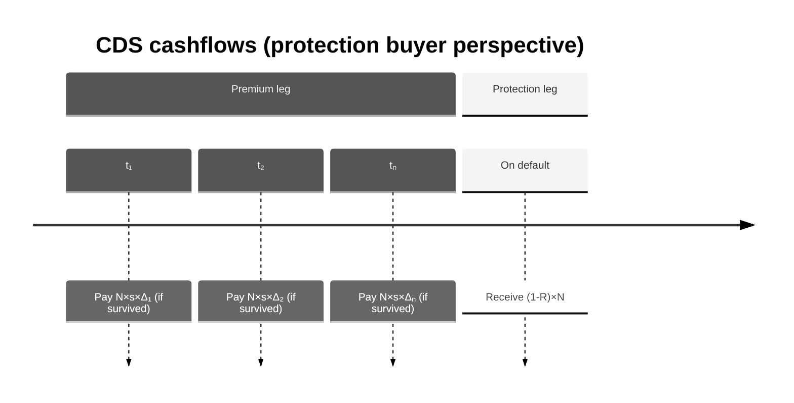

# Credit Default Swap (CDS): Concept, Valuation, Risk, and Implementation

This document explains the Credit Default Swap (CDS) conceptually, how valuation and risk are calculated in this project, and how to use the library to compute PV and CS01.

---

## 1. What is a CDS? (Business intuition)

A **Credit Default Swap (CDS)** is an insurance-like contract on the default of a reference entity (a company or sovereign):

- The **protection buyer** pays a periodic premium (the CDS spread \(s\)) on a notional amount until maturity or until default.
- The **protection seller** pays a lump sum if default occurs: \((1-R) \times N\), where \(N\) is the notional and \(R\) is the recovery rate (fraction of notional recovered after default).

**Who uses it**

- **Banks and investors** hedge bond or loan exposure to credit risk.
- **Traders** express views on credit quality (widening or tightening spreads).
- **Risk managers** measure and transfer default risk.

**Key business idea:** The CDS spread reflects the market’s view of default probability. Higher perceived default risk implies a higher spread.

---

## 2. Cashflows (timeline)

At each payment date \(t_i\) (e.g. quarterly or semiannual):

- **Premium leg:** Protection buyer pays \(N \times s \times \Delta_i\) (accrual fraction \(\Delta_i\)), **only if the entity has not defaulted** by \(t_i\).

- **Protection leg:** If default occurs between \(t_{i-1}\) and \(t_i\), protection seller pays \((1-R) \times N\) at settlement.



---

## 3. Valuation (step-by-step)

### 3.1 Inputs

You need:

- A **discount curve** \(DF(t)\) — time value of money (risk-free or funding).
- A **survival curve** \(S(t) = P(\tau > t)\) — probability the reference entity survives to time \(t\).
- A **recovery rate** \(R\) — fraction of notional recovered after default.

In this library, the survival curve is represented by a **HazardRateCurve**: piecewise-constant hazard rates \(h(t)\) with \(S(t) = \exp(-\int_0^t h(u)\,du)\).

### 3.2 Premium leg PV

**When are premiums paid?** The protection buyer owes a premium at each scheduled date \(t_i\). Crucially, the premium is paid **only if the reference entity has not defaulted by that date**. If default occurs before \(t_i\), no premium is due at \(t_i\) or any later date.

**Example:** With quarterly dates at 0.25Y, 0.5Y, 0.75Y, 1Y and default at 0.6Y, premiums are paid at 0.25Y and 0.5Y, but not at 0.75Y or 1Y (the entity has already defaulted).

**Present value.** To value the premium leg, we sum over all payment dates. At each date \(t_i\):

- The contractual cashflow (if paid) is \(N \times s \times \Delta_i\), where \(\Delta_i = t_i - t_{i-1}\) is the accrual fraction.
- We weight this by \(S(t_i)\), the probability the entity survives to \(t_i\) (so we only “count” the premium when it is actually paid).
- We discount to today using \(DF(t_i)\).

\[
PV_{premium} = \sum_i N \times s \times \Delta_i \times DF(t_i) \times S(t_i)
\]

| Term | Meaning |
|------|---------|
| \(N \times s \times \Delta_i\) | Premium cashflow at \(t_i\) (if paid) |
| \(S(t_i)\) | Probability of surviving to \(t_i\) → premium is paid |
| \(DF(t_i)\) | Discount factor to today |

### 3.3 Protection leg PV (discrete default approximation)

**When is the protection payment made?** If the reference entity defaults, the protection seller pays the **loss given default** \((1-R) \times N\) to the buyer. This is not the full notional \(N\): it is the amount the buyer loses on the reference obligation, since they recover fraction \(R\) in bankruptcy. (Typical \(R \approx 40\%\) for senior unsecured debt.)

**What is the probability of default in each period?** For each interval \((t_{i-1}, t_i)\), the probability that default occurs in that interval is:
- \(S(t_{i-1})\) = probability of surviving to the start of the period
- \(S(t_i)\) = probability of surviving to the end of the period
- So \(S(t_{i-1}) - S(t_i)\) = probability of defaulting *during* the period

**Example:** If \(S(0.5) = 0.99\) and \(S(1.0) = 0.97\), then the probability of default between 0.5Y and 1Y is \(0.99 - 0.97 = 0.02\) (2%).

**Where do we assume default occurs?** Default can happen at any time within \((t_{i-1}, t_i)\). For discounting, we approximate by assuming default occurs at the **midpoint** \(t_{mid,i} = (t_{i-1} + t_i) / 2\). This is a standard discrete-time approximation.

**Present value.** Sum over all periods: in each period, the expected protection payoff is \((1-R) \times N \times \bigl(S(t_{i-1}) - S(t_i)\bigr)\), discounted from the midpoint:

\[
PV_{protection} = \sum_i (1-R) \times N \times DF(t_{mid,i}) \times \bigl(S(t_{i-1}) - S(t_i)\bigr)
\]

| Term | Meaning |
|------|---------|
| \((1-R) \times N\) | Protection payment (loss given default) paid on default |
| \(S(t_{i-1}) - S(t_i)\) | Probability of default in \((t_{i-1}, t_i)\) |
| \(DF(t_{mid,i})\) | Discount factor from midpoint of period to today |

### 3.4 CDS NPV (protection buyer convention)

\[
PV = PV_{protection} - PV_{premium}
\]

- **Positive PV** — protection is worth more than premiums paid (spread is “cheap”).
- **Negative PV** — premiums exceed protection value (spread is “rich”).

If the protection buyer pays and the protection seller receives, the seller’s NPV is \(-PV\).

### 3.5 Fair spread

The **fair spread** \(s^*\) is the spread that sets \(PV = 0\):

\[
s^* = \frac{PV_{protection}}{\sum_i N \times \Delta_i \times DF(t_i) \times S(t_i)}
\]

The denominator is the **risky annuity** (PV of $1 per period, paid only if survived).

---

## 4. Credit risk: CS01

### 4.1 Definition

**CS01** (Credit Spread 01) answers: “If I bump the hazard curve up by 1 basis point (parallel), how does PV change?”

- Bump: add \(0.0001\) to every hazard rate.
- **CS01 = PV(bumped) − PV(base)**

### 4.2 Interpretation

- For a **protection buyer**, higher hazard ⇒ more default probability ⇒ protection leg worth more ⇒ PV typically **increases** ⇒ CS01 **positive**.
- CS01 magnitude scales with notional and maturity.

---

## 5. Implementation in this project

### 5.1 Components

| Component | Location | Role |
|-----------|----------|------|
| **CDS** | `pricing/products/cds.py` | Data-only instrument (discount_curve, survival_curve, notional, premium_rate, pay_times, recovery, t0, protection_buyer) |
| **HazardRateCurve** | `pricing/curves.py` | Survival curve; `df(t)` returns \(S(t)\), `bumped(bump)` shifts hazard rates |
| **CDSPricer** | `pricing/pricers/cds_pricer.py` | Premium + protection legs, registered in `PricingEngine` |
| **CS01Parallel** | `pricing/risk/cs01.py` | Bump-and-reprice hazard sensitivity |

### 5.2 HazardRateCurve convention

The library reuses the `Curve` protocol for survival curves:

- **HazardRateCurve** has `pillars` and `hazard_rates` (piecewise-constant).
- `df(t)` returns survival probability \(S(t)\), **not** a discount factor.
- `bumped(bump)` adds `bump` to all hazard rates (1 bp = 0.0001).

### 5.3 Market setup

A CDS needs two curves in `Market`:

- A **discount curve** (e.g. `ZeroRateCurve`) for \(DF(t)\).
- A **survival curve** (`HazardRateCurve`) for \(S(t)\).

Both are stored in `Market.curves` and referenced by name.

### 5.4 Implementation snippets (how PV and CS01 are calculated)

The following snippets are taken from the library source to illustrate how the formulas above are implemented.

**Premium leg** (`pricing/pricers/cds_pricer.py`):

```python
@staticmethod
def _pv_premium_leg(cds: CDS, disc: Curve, surv: Curve) -> float:
    """Premium leg: sum_i N * s * accrual_i * DF(t_i) * S(t_i)."""
    pv = 0.0
    prev = cds.t0
    for t in cds.pay_times:
        accrual = t - prev
        pv += (
            cds.notional
            * cds.premium_rate
            * accrual
            * disc.df(t)      # DF(t) from discount curve
            * surv.df(t)      # S(t) from survival curve
        )
        prev = t
    return pv
```

**Protection leg** (`pricing/pricers/cds_pricer.py`):

```python
@staticmethod
def _pv_protection_leg(cds: CDS, disc: Curve, surv: Curve) -> float:
    """Protection leg (discrete): sum_i N(1-R) * DF(t_mid) * (S(t_{i-1}) - S(t_i))."""
    pv = 0.0
    prev = cds.t0
    s_prev = surv.df(prev)    # S(t_{i-1})
    for t in cds.pay_times:
        s_t = surv.df(t)      # S(t_i)
        t_mid = (prev + t) / 2.0
        prob_default = s_prev - s_t   # P(default in (t_{i-1}, t_i))
        pv += (
            cds.notional
            * (1.0 - cds.recovery)
            * disc.df(t_mid)
            * prob_default
        )
        prev = t
        s_prev = s_t
    return pv
```

**NPV assembly** (protection buyer vs seller):

```python
def npv(self, instrument: Instrument, market: Market) -> float:
    cds = instrument
    disc = market.curve(cds.discount_curve)
    surv = market.curve(cds.survival_curve)
    pv_premium = self._pv_premium_leg(cds, disc, surv)
    pv_protection = self._pv_protection_leg(cds, disc, surv)
    npv = pv_protection - pv_premium
    return npv if cds.protection_buyer else -npv
```

**CS01 (bump-and-reprice)** (`pricing/risk/cs01.py`):

```python
def compute(self, instrument: Instrument, market: Market) -> float:
    """PV(bumped) - PV(base) for parallel hazard curve shift."""
    bump = self.bump_bp / 10000.0   # e.g. 1 bp -> 0.0001
    curve = market.curve(self.hazard_curve_name)
    bumped_curve = curve.bumped(bump)   # add bump to all hazard rates
    bumped_market = market.with_curve(self.hazard_curve_name, bumped_curve)
    return price(instrument, bumped_market) - price(instrument, market)
```

---

## 6. Library usage (code examples)

### 6.1 PV and CS01 with the pricing library

```python
from pricing import (
    CDS,
    HazardRateCurve,
    Market,
    ZeroRateCurve,
    cs01_parallel,
    price,
)

# 1) Build discount curve (risk-free / funding)
disc_curve = ZeroRateCurve(
    name="USD_DISC",
    pillars=[0.5, 1.0, 2.0, 5.0, 10.0],
    zero_rates_cc=[0.045, 0.043, 0.040, 0.038, 0.037],
)

# 2) Build hazard/survival curve (flat 1% hazard)
hazard_curve = HazardRateCurve(
    name="CORP_HAZ",
    pillars=[0.5, 1.0, 2.0, 5.0, 10.0],
    hazard_rates=[0.01, 0.01, 0.01, 0.01, 0.01],
)

# 3) Market snapshot
market = Market(
    curves={"USD_DISC": disc_curve, "CORP_HAZ": hazard_curve},
)

# 4) CDS: 5Y, 10M notional, 100bp spread, protection buyer
cds = CDS(
    discount_curve="USD_DISC",
    survival_curve="CORP_HAZ",
    notional=10_000_000,
    premium_rate=0.01,  # 100 bp
    pay_times=[0.5, 1.0, 1.5, 2.0, 2.5, 3.0, 3.5, 4.0, 4.5, 5.0],
    recovery=0.4,
    protection_buyer=True,
)

# 5) Price and risk
pv = price(cds, market)
cs01 = cs01_parallel(cds, market, hazard_curve_name="CORP_HAZ", bump_bp=1.0)

print(f"NPV:  {pv:,.2f}")
print(f"CS01: {cs01:,.2f}")
```

### 6.2 Fair spread (optional)

To find the par spread that sets NPV ≈ 0:

```python
from pricing.pricers.cds_pricer import CDSPricer

fair = CDSPricer.fair_spread(cds, market)
print(f"Fair spread: {fair*10000:.1f} bp")

# Price at fair spread
cds_at_fair = CDS(
    discount_curve="USD_DISC",
    survival_curve="CORP_HAZ",
    notional=10_000_000,
    premium_rate=fair,  # use fair spread
    pay_times=[0.5, 1.0, 1.5, 2.0, 2.5, 3.0, 3.5, 4.0, 4.5, 5.0],
    recovery=0.4,
)
pv_at_fair = price(cds_at_fair, market)
print(f"NPV at fair spread: {pv_at_fair:,.2f}")  # near zero
```

### 6.3 Composable risk measure (CS01Parallel)

For use alongside other risk measures:

```python
from pricing import CS01Parallel

measure = CS01Parallel(hazard_curve_name="CORP_HAZ", bump_bp=1.0)
cs01_val = measure.compute(cds, market)

print(measure.name)   # "CS01_CORP_HAZ"
print(cs01_val)       # same as cs01_parallel(...)
```

### 6.4 Via the API client (Jupyter / scripts)

When calling the GraphQL API through the Python client:

```python
from pricing_client import (
    CDSInput,
    CurveInput,
    HazardCurveInput,
    MarketInput,
    PricingClient,
)

client = PricingClient("http://api:8000/graphql")

disc_curve = CurveInput(
    name="USD_DISC",
    pillars=[0.5, 1.0, 2.0, 5.0, 10.0],
    zero_rates_cc=[0.045, 0.043, 0.040, 0.038, 0.037],
)
hazard_curve = HazardCurveInput(
    name="CORP_HAZ",
    pillars=[0.5, 1.0, 2.0, 5.0, 10.0],
    hazard_rates=[0.01, 0.01, 0.01, 0.01, 0.01],
)
market = MarketInput(curves=[disc_curve], hazard_curves=[hazard_curve])

cds = CDSInput(
    discount_curve="USD_DISC",
    survival_curve="CORP_HAZ",
    notional=10_000_000,
    premium_rate=0.01,
    pay_times=[0.5, 1.0, 1.5, 2.0, 2.5, 3.0, 3.5, 4.0, 4.5, 5.0],
    recovery=0.4,
)

result = client.price_cds(cds, market, calculate_cs01=True)
print(f"NPV:  {result.npv:,.2f}")
print(f"CS01: {result.cs01:,.2f}")
```

---

## 7. Demo output (reference)

With the demo market (USD_DISC + CORP_HAZ flat 1%) and a 5Y 10M notional CDS at 100 bp:

- **NPV** ≈ −171,924 (protection buyer paying 100 bp on a 1% hazard curve; premium leg dominates)
- **CS01** ≈ 2,709 (bumping hazard +1 bp increases PV for the protection buyer)

Run `poetry run python -m pricing.demo` from the pricing-library directory to reproduce.

---

## 8. Simplifications vs production

| Aspect | This library | Production systems |
|--------|--------------|--------------------|
| Day-count / calendars | Year-fractions only | ACT/360, 30/360, etc. |
| Accrual-on-default | Not modeled | Typically included |
| Curve bootstrapping | Manual pillar input | Bootstrapped from market quotes |
| Recovery | Fixed input | May be stochastic or market-implied |
| Multi-name / index CDS | Single-name only | Index, tranches, etc. |

The implementation is minimal and pedagogical; it illustrates the core valuation and risk mechanics.
