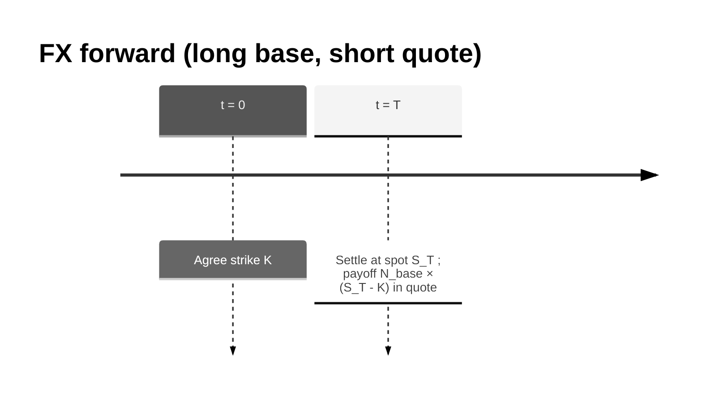

# FX Forward: Concept, Valuation, Risk, and Implementation

This document explains the FX forward conceptually, how valuation and risk are calculated in this project, and how to use the library to compute PV, FX delta, and PV01.

---

## 1. What is an FX forward? (Business intuition)

An **FX forward** is an agreement to exchange one currency for another at a future date at a **strike rate** agreed today:

- You agree today on a strike \(K\) (quote per base).
- At maturity \(T\), you exchange notional in base currency for the equivalent in quote currency at rate \(K\).

**Who uses it**

- **Corporates** hedge FX exposure on future cashflows (e.g. EUR revenue, USD costs).
- **Traders** express views on FX moves and manage currency risk.
- **Banks** provide hedging and market-making in FX forwards.

**Key business idea:** The forward locks the exchange rate. The value today depends on how the current forward rate compares to the strike. This library uses **covered interest rate parity (CIP)** with base and quote discount curves.

---

## 2. Conventions

- **Pair:** e.g. `EURUSD` means base = EUR, quote = USD.
- **Rate interpretation:** EURUSD = 1.08 means 1 EUR = 1.08 USD.
- **Notional:** `notional_base` is in base currency (EUR). PV is in **quote currency** (USD).

### 2.1 Covered interest rate parity (CIP) and curves

**What is CIP?** Covered interest rate parity is a no-arbitrage condition that links the spot rate, the forward rate, and interest rates in the two currencies. It says you cannot make risk-free profit by borrowing in one currency, converting at spot, investing in the other, and locking in the conversion back with a forward — the forward rate must reflect the interest rate differential.

**Base and quote discount curves.** For a pair like EURUSD (base = EUR, quote = USD), you need two discount curves:

- **Base curve** (e.g. `EUR_DISC`): discount curve for the base currency (EUR). It gives \(DF_{base}(T)\) — the discount factor in EUR to maturity \(T\).
- **Quote curve** (e.g. `USD_DISC`): discount curve for the quote currency (USD). It gives \(DF_{quote}(T)\) — the discount factor in USD to maturity \(T\).

The forward rate is implied by spot and these two curves via CIP: \(F_T = S_0 \times DF_{base}(T) / DF_{quote}(T)\). Both curves are required because the forward depends on interest rates in *both* countries.

**How this library uses it.** The pricer fetches both curves from the market, computes \(F_T\) using the CIP formula, then values the forward as \(N_{base} \times DF_{quote}(T) \times (F_T - K)\). You must supply both `base_curve` and `quote_curve` when constructing an FX forward.

---

## 3. Cashflows (timeline)

- At \(t = 0\): agree strike \(K\).
- At \(t = T\): settle the forward — effectively exchange at spot (or forward in a full model). The payoff in quote currency is \(N_{base} \times (S_T - K)\), where \(S_T\) is the spot (or forward) at \(T\).



---

## 4. Valuation (step-by-step)

### 4.1 Inputs

You need:

- A **base discount curve** \(DF_{base}(t)\) — for the base currency (e.g. EUR).
- A **quote discount curve** \(DF_{quote}(t)\) — for the quote currency (e.g. USD), used to discount the payoff.
- **FX spot** for the pair — e.g. EURUSD = 1.08.

### 4.2 PV formula (covered interest rate parity)

The forward rate at \(T\) satisfies covered interest rate parity:

\[
F_T = S_0 \times \frac{DF_{base}(T)}{DF_{quote}(T)}
\]

The present value in quote currency is:

\[
PV = N_{base} \times DF_{quote}(T) \times (F_T - K)
\]

**Interpretation:**
- \(F_T\) = forward rate (quote per base) at maturity, implied by spot and discount curves.
- \(N_{base} \times (F_T - K)\) = payoff in quote at maturity.
- \(DF_{quote}(T)\) = discount factor in quote currency from \(T\) to today.
- PV is in **quote currency**.

| Term | Meaning |
|------|---------|
| \(N_{base}\) | Notional in base currency |
| \(DF_{base}(T)\) | Discount factor in base currency to maturity |
| \(DF_{quote}(T)\) | Discount factor in quote currency to maturity |
| \(S_0\) | Spot rate (quote per base) |
| \(K\) | Strike (quote per base) |

**Example (1Y, 5M EUR notional, strike 1.085, spot 1.08, EUR rates lower than USD):**

With EUR rates < USD rates, \(F_T > S_0\). If \(F_T \approx 1.0804\), then \(PV \approx 5M \times DF_{USD}(1) \times (1.0804 - 1.085) \approx 5M \times 0.958 \times (-0.0046) \approx -22{,}000\) (negative: strike above forward).

---

## 5. Risk: FX delta and PV01

### 5.1 FX delta — definition

**FX delta** answers: “If spot moves by 1 unit (quote per base), how does PV (in quote) change?”

With CIP, \(F = S \times DF_{base}/DF_{quote}\), so \(\frac{\partial F}{\partial S} = DF_{base}/DF_{quote}\) and:

\[
\frac{\partial PV}{\partial S} = N_{base} \times DF_{base}(T)
\]

In this library, FX delta is computed as a finite-difference:
- Bump spot by a small percentage (e.g. 1%).
- **FX delta = (PV(bumped) − PV(base)) / (spot_bumped − spot)**

### 5.2 Interpretation

- Long base (buy EUR, sell USD) ⇒ PV increases when spot rises ⇒ delta **positive**.
- For 5M EUR, \(DF_{base}(1) \approx 0.96\) ⇒ delta ≈ 4.8M USD per 1 EUR/USD move.

### 5.3 PV01 (quote curve)

**PV01** answers: “If I bump the quote discount curve up by 1 basis point, how does PV change?”

- Bump: add \(0.0001\) to every zero rate on the quote curve.
- **PV01 = PV(bumped) − PV(base)**

Higher rates ⇒ lower \(DF_{quote}(T)\) ⇒ PV (in quote) decreases for a long forward.

---

## 6. Implementation in this project

### 6.1 Components

| Component | Location | Role |
|-----------|----------|------|
| **FXForward** | `pricing/products/fx.py` | Data-only instrument (pair, base_curve, quote_curve, maturity, notional_base, strike) |
| **FXPricer** | `pricing/pricers/fx_pricer.py` | F = spot × DF_base/DF_quote; PV = notional_base × DF_quote × (F − strike); registered in `PricingEngine` |
| **FXDelta** | `pricing/risk/fx_delta.py` | Finite-difference FX delta |
| **PV01Parallel** | `pricing/risk/pv01.py` | Bump-and-reprice curve sensitivity |

### 6.2 Market setup

An FX forward needs:

- A **base discount curve** in `Market.curves` (e.g. `EUR_DISC` for EURUSD).
- A **quote discount curve** in `Market.curves` (e.g. `USD_DISC`).
- The **FX spot** for the pair in `Market.fx_spot` (e.g. `{"EURUSD": 1.08}`).

### 6.3 Implementation snippet (how PV is calculated)

From `pricing/pricers/fx_pricer.py`:

```python
def npv(self, instrument: Instrument, market: Market) -> float:
    """
    FX forward: F = spot * DF_base(T) / DF_quote(T), PV = notional_base * DF_quote(T) * (F - strike).
    """
    fwd = instrument
    spot = market.fx(fwd.pair)
    df_base = market.curve(fwd.base_curve).df(fwd.maturity)
    df_quote = market.curve(fwd.quote_curve).df(fwd.maturity)
    fwd_rate = spot * df_base / df_quote
    return (
        fwd.notional_base
        * df_quote
        * (fwd_rate - fwd.strike)
    )
```

**FX delta** (`pricing/risk/fx_delta.py`):

```python
def compute(self, instrument: Instrument, market: Market) -> float:
    """Finite-difference delta with relative spot bump."""
    spot = market.fx(self.pair)
    spot_bumped = spot * (1.0 + self.bump_pct)
    bumped_market = market.with_fx(self.pair, spot_bumped)
    pv_base = price(instrument, market)
    pv_bumped = price(instrument, bumped_market)
    return (pv_bumped - pv_base) / (spot_bumped - spot)
```

---

## 7. Library usage (code examples)

### 7.1 PV, FX delta, and PV01 with the pricing library

```python
from pricing import FXForward, Market, ZeroRateCurve, fx_delta, price, pv01_parallel

eur_curve = ZeroRateCurve(
    name="EUR_DISC",
    pillars=[0.5, 1.0, 2.0, 5.0, 10.0],
    zero_rates_cc=[0.040, 0.038, 0.036, 0.034, 0.033],
)
usd_curve = ZeroRateCurve(
    name="USD_DISC",
    pillars=[0.5, 1.0, 2.0, 5.0, 10.0],
    zero_rates_cc=[0.045, 0.043, 0.040, 0.038, 0.037],
)
market = Market(
    curves={"EUR_DISC": eur_curve, "USD_DISC": usd_curve},
    fx_spot={"EURUSD": 1.08},
)

fxfwd = FXForward(
    pair="EURUSD",
    base_curve="EUR_DISC",
    quote_curve="USD_DISC",
    maturity=1.0,
    notional_base=5_000_000,
    strike=1.085,
)

pv = price(fxfwd, market)
fx_d = fx_delta(fxfwd, market, pair="EURUSD", bump_pct=0.01)
pv01_val = pv01_parallel(fxfwd, market, curve_name="USD_DISC", bump_bp=1.0)

print(f"NPV:      {pv:,.2f}")
print(f"FX delta: {fx_d:,.2f}")
print(f"PV01:     {pv01_val:,.2f}")
```

### 7.2 Composable risk measures

```python
from pricing import FXDelta, PV01Parallel

fx_measure = FXDelta(pair="EURUSD", bump_pct=0.01)
pv01_measure = PV01Parallel(curve_name="USD_DISC", bump_bp=1.0)

fx_d = fx_measure.compute(fxfwd, market)
pv01_val = pv01_measure.compute(fxfwd, market)
```

### 7.3 Via the API client (GraphQL)

The API supports `price_fx_forward`. Pass `FXForwardInput` (with `base_curve` and `quote_curve`) and `MarketInput` containing both curves and `fx_spot`. Request `calculate_pv01` and `calculate_fx_delta` as needed.

---

## 8. Demo output (reference)

With the demo market (EUR_DISC, USD_DISC, EURUSD = 1.08) and a 1Y FX forward (5M EUR, strike 1.085):

- **NPV** ≈ 1,981
- **PV01** ≈ 520 (quote curve bump)
- **FX delta** ≈ 4.81M (USD per 1 EUR/USD move)

Run `poetry run python -m pricing.demo` from the pricing-library directory to reproduce.

---

## 9. Simplifications vs production

| Aspect | This library | Production systems |
|--------|--------------|--------------------|
| Valuation | CIP (F = S × DF_base/DF_quote) | Same; may add cross-currency basis |
| Curves | Base + quote discount curves | Same; multiple tenors, basis spreads |
| Day-count | Year-fractions only | ACT/360, etc. |
| Settlement | Simplified | Actual delivery, NDF, etc. |

The implementation illustrates production-style CIP valuation and FX delta.
