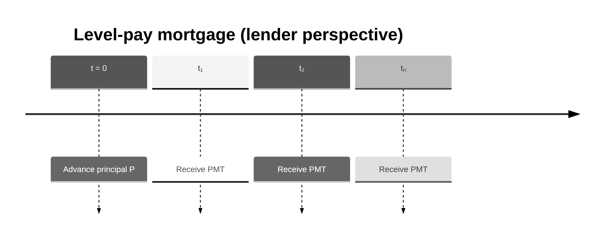

# Level-Pay Mortgage: Concept, Valuation, Risk, and Implementation

This document explains the level-pay mortgage conceptually, how valuation and risk are calculated in this project, and how to use the library to compute PV and PV01.

---

## 1. What is a level-pay mortgage? (Business intuition)

A **level-pay mortgage** is a fixed-rate, amortizing loan:

- The borrower receives a **principal** \(P\) at inception.
- The borrower makes equal **level payments** over the life of the loan. Each payment covers interest and principal; over time the principal is paid down.
- There are **no prepayments** or defaults in this model.

**Who uses it**

- **Lenders** (banks, investors) hold mortgages as assets — the PV of future payments is the value of the loan.
- **Borrowers** use mortgages to finance home purchases.
- **Securitization** treats mortgage pools as collateral for MBS.

**Key business idea:** The value to the lender is the present value of all scheduled payments, discounted at market rates. When market rates rise, the fixed payments are worth less ⇒ PV falls.

---

## 2. Cashflows (timeline)

- At \(t = 0\): lender advances principal \(P\) (we do not model this explicitly; we value the **asset side** — the payments the lender receives).
- At each payment date \(t_i\): lender receives a **level payment** \(PMT\) (interest + principal).



---

## 3. Valuation (step-by-step)

### 3.1 Inputs

You need:

- A **discount curve** \(DF(t)\) — time value of money for the lender’s funding or opportunity cost.

### 3.2 Level payment formula

The **level payment** \(PMT\) is constant and satisfies: the PV of all \(PMT\) at the loan rate equals the principal.

Let:
- \(P\) = initial principal (notional)
- \(r\) = periodic rate = \(r_{annual} / m\), where \(m\) = payments per year
- \(n\) = total number of payments = \(term\_years \times m\)

\[
PMT = P \times \frac{r (1+r)^n}{(1+r)^n - 1}
\]

**Example:** \(P = 500{,}000\), \(r_{annual} = 6\%\), \(m = 12\), \(n = 60\):
\[
r = 0.06/12 = 0.005
\]
\[
PMT = 500{,}000 \times \frac{0.005 \times 1.005^{60}}{1.005^{60} - 1} \approx 9{,}666
\]

### 3.3 Present value (lender asset)

The value of the mortgage to the lender is the PV of all scheduled payments, discounted at the **market** curve (not the loan rate):

\[
PV = \sum_{i=1}^{n} PMT \times DF(t_i)
\]

where \(t_i = i/m\) (e.g. 1/12, 2/12, …, 60/12 for monthly over 5 years).

| Term | Meaning |
|------|---------|
| \(PMT\) | Level payment (interest + principal) |
| \(DF(t_i)\) | Discount factor from market curve at \(t_i\) |
| \(t_i\) | Payment time (year-fraction) |

**Term table (first few periods):**

| \(i\) | \(t_i\) | \(PMT\) | \(DF(t_i)\) | PV contribution |
|-------|---------|---------|-------------|------------------|
| 1     | 0.083   | 9,666   | ~0.996      | ~9,625           |
| 2     | 0.167   | 9,666   | ~0.993      | ~9,599           |
| …     | …       | …       | …           | …                |
| 60    | 5.0     | 9,666   | ~0.835      | ~8,069           |

\(PV\) = sum of all contributions. For the demo (5Y, 500k, 6%, monthly), \(PV \approx 525{,}561\).

---

## 4. Interest rate risk: PV01

### 4.1 Definition

**PV01** answers: “If I bump the discount curve up by 1 basis point (parallel), how does PV change?”

- Bump: add \(0.0001\) to every zero rate.
- **PV01 = PV(bumped) − PV(base)**

### 4.2 Interpretation

For a mortgage (lender asset), when rates rise:
- Future payments are discounted more heavily ⇒ PV **decreases**.
- PV01 is **negative** (similar to a bond).

---

## 5. Implementation in this project

### 5.1 Components

| Component | Location | Role |
|-----------|----------|------|
| **LevelPayMortgage** | `pricing/products/mortgage.py` | Data-only instrument (curve, notional, annual_rate, term_years, payments_per_year) |
| **MortgagePricer** | `pricing/pricers/mortgage_pricer.py` | Level payment + PV sum; registered in `PricingEngine` |
| **PV01Parallel** | `pricing/risk/pv01.py` | Bump-and-reprice curve sensitivity |

### 5.2 Conventions

- **Periodic rate:** \(r = annual\_rate / payments\_per\_year\) (simple periodic compounding).
- **Payment times:** \(t_i = i / payments\_per\_year\) for \(i = 1, 2, \ldots, n\).
- **No prepayment, no default.**

### 5.3 Implementation snippets (how PV is calculated)

**Level payment and PV** (`pricing/pricers/mortgage_pricer.py`):

```python
def npv(self, instrument: Instrument, market: Market) -> float:
    """
    Level-pay mortgage: constant payment from annuity formula,
    PV = sum of payment * DF(t_i) over pay_times.
    """
    m = instrument
    c = market.curve(m.curve)
    n = int(m.term_years * m.payments_per_year)
    r = m.annual_rate / m.payments_per_year
    if r == 0:
        payment = m.notional / n
    else:
        payment = (
            m.notional
            * (r * (1 + r) ** n)
            / ((1 + r) ** n - 1)
        )
    pay_times = [
        i / m.payments_per_year for i in range(1, n + 1)
    ]
    return sum(payment * c.df(t) for t in pay_times)
```

---

## 6. Library usage (code examples)

### 6.1 PV and PV01 with the pricing library

```python
from pricing import LevelPayMortgage, Market, ZeroRateCurve, price, pv01_parallel

usd_curve = ZeroRateCurve(
    name="USD_DISC",
    pillars=[0.5, 1.0, 2.0, 5.0, 10.0],
    zero_rates_cc=[0.045, 0.043, 0.040, 0.038, 0.037],
)
market = Market(curves={"USD_DISC": usd_curve})

mortgage = LevelPayMortgage(
    curve="USD_DISC",
    notional=500_000,
    annual_rate=0.06,
    term_years=5.0,
    payments_per_year=12,
)

pv = price(mortgage, market)
pv01_val = pv01_parallel(mortgage, market, curve_name="USD_DISC", bump_bp=1.0)

print(f"NPV:  {pv:,.2f}")
print(f"PV01: {pv01_val:,.2f}")
```

### 6.2 Composable risk measure (PV01Parallel)

```python
from pricing import PV01Parallel

measure = PV01Parallel(curve_name="USD_DISC", bump_bp=1.0)
pv01_val = measure.compute(mortgage, market)
```

### 6.3 Via the API client (GraphQL)

The API supports `price_mortgage`. Usage mirrors the bond pattern: pass `MortgageInput` and `MarketInput`, and set `calculate_pv01=True`. If the client lacks a dedicated method, use the generic GraphQL query with variables for the mortgage endpoint.

---

## 7. Demo output (reference)

With the demo market (USD_DISC curve) and a 5Y level-pay mortgage (500k notional, 6% annual rate, monthly payments):

- **NPV** ≈ 525,561
- **PV01** ≈ −129 (negative: rates up ⇒ PV down)

Run `poetry run python -m pricing.demo` from the pricing-library directory to reproduce.

---

## 8. Simplifications vs production

| Aspect | This library | Production systems |
|--------|--------------|--------------------|
| Prepayment | None | CPR, PSA, burnout models |
| Default | None | Default probability, LGD |
| Rate convention | Simple periodic (\(r/m\)) | Various (compounded, etc.) |
| Day-count | Year-fractions only | ACT/360, 30/360, etc. |
| Curves | Single discount curve | OAS, option-adjusted spreads |

The implementation is minimal and pedagogical; it illustrates the level-payment annuity formula and discounting.
