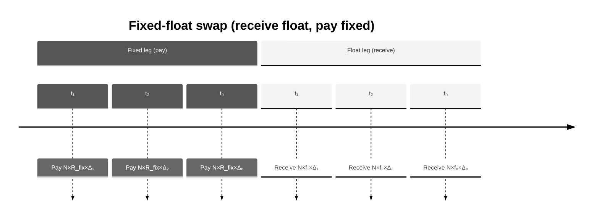

# Fixed-Float Interest Rate Swap: Concept, Valuation, Risk, and Implementation

This document explains the fixed-float interest rate swap conceptually, how valuation and risk are calculated in this project, and how to use the library to compute PV and PV01.

---

## 1. What is a fixed-float swap? (Business intuition)

A **fixed-float interest rate swap** is an agreement to exchange fixed-rate payments for floating-rate payments over a set of dates:

- The **fixed leg**: one party pays a fixed rate \(R_{fix}\) on a notional at each period.
- The **float leg**: the other party pays a floating rate (typically linked to a reference rate such as SOFR or LIBOR) at each period.

In this library, the convention is **receive float, pay fixed**. So NPV = PV(float leg) − PV(fixed leg).

**Who uses it**

- **Corporates** hedge floating-rate debt by swapping to fixed (or vice versa).
- **Banks** manage interest rate exposure and offer swap execution.
- **Traders** express views on the direction of rates (steepeners, flatteners).

**Key business idea:** The swap allows parties to transform their interest rate profile without changing the underlying principal. The fixed rate that makes NPV = 0 is the **par swap rate**.

---

## 2. Cashflows (timeline)

At each payment date \(t_i\) (e.g. semiannual at 0.5, 1.0, 1.5, 2.0):

- **Fixed leg:** pay \(N \times R_{fix} \times \Delta_i\).
- **Float leg:** receive \(N \times f_i \times \Delta_i\), where \(f_i\) is the forward rate for \((t_{i-1}, t_i)\).

Here \(\Delta_i = t_i - t_{i-1}\) is the accrual fraction (year-fraction).



---

## 3. Valuation (step-by-step)

### 3.1 Inputs

You need:

- A **single discount curve** \(DF(t)\) — used both to discount and to imply forward rates.

This library assumes a single curve (no OIS/IBOR basis). The curve is a **ZeroRateCurve** with continuously compounded rates.

### 3.2 Fixed leg PV

The fixed leg pays \(N \times R_{fix} \times \Delta_i\) at each \(t_i\). Its present value is:

\[
PV_{fixed} = \sum_i N \times R_{fix} \times \Delta_i \times DF(t_i)
\]

**Term table:**

| Term | Meaning |
|------|---------|
| \(N\) | Notional |
| \(R_{fix}\) | Fixed rate |
| \(\Delta_i = t_i - t_{i-1}\) | Accrual fraction (year-fraction) |
| \(DF(t_i)\) | Discount factor to today |

**Example (2Y semiannual, \(N=10{,}000{,}000\), \(R_{fix}=4\%\)):**

| \(t_i\) | \(\Delta_i\) | \(N \times R_{fix} \times \Delta_i\) | \(DF(t_i)\) | PV contribution |
|---------|--------------|--------------------------------------|-------------|------------------|
| 0.5     | 0.5          | 200,000                               | ~0.978      | ~195,600         |
| 1.0     | 0.5          | 200,000                               | ~0.958      | ~191,600         |
| 1.5     | 0.5          | 200,000                               | ~0.938      | ~187,600         |
| 2.0     | 0.5          | 200,000                               | ~0.923      | ~184,600         |

\(PV_{fixed}\) = sum of last column.

### 3.3 Float leg PV (single-curve, telescoping)

The floating leg pays the **forward rate** \(f_i\) for \((t_{i-1}, t_i)\), set at the start of the period. On a single curve, the forward rate is implied by discount factors:

\[
f_i = \frac{DF(t_{i-1}) / DF(t_i) - 1}{\Delta_i}
\]

The cashflow at \(t_i\) is \(N \times f_i \times \Delta_i\). Its present value is \(N \times f_i \times \Delta_i \times DF(t_i)\).

**Telescoping sum:** Substituting \(f_i\) and simplifying:
\[
PV_{float} = \sum_i N \times \frac{DF(t_{i-1})/DF(t_i) - 1}{\Delta_i} \times \Delta_i \times DF(t_i) = \sum_i N \times \bigl(DF(t_{i-1}) - DF(t_i)\bigr)
\]

So:
\[
PV_{float} = N \times \bigl(DF(t_0) - DF(t_n)\bigr) = N \times (1 - DF(T))
\]

where \(t_0 = 0\) and \(t_n = T\) (maturity). Under single-curve, the float leg PV simplifies to \(N(1 - DF(T))\).

### 3.4 Swap NPV (receive float, pay fixed)

\[
NPV = PV_{float} - PV_{fixed}
\]

- **Positive NPV** — floating leg worth more than fixed leg (you receive float, so you benefit when rates rise).
- **Negative NPV** — fixed leg dominates (you pay fixed; your position loses when rates rise).

### 3.5 Par swap rate (optional)

The **par swap rate** \(R^*\) is the fixed rate that sets \(NPV = 0\):

\[
R^* = \frac{PV_{float}}{\sum_i N \times \Delta_i \times DF(t_i)}
\]

The denominator is the **annuity** (PV of $1 per period).

---

## 4. Interest rate risk: PV01

### 4.1 Definition

**PV01** answers: “If I bump the entire discount curve up by 1 basis point (parallel), how does PV change?”

- Bump: add \(0.0001\) to every zero rate.
- **PV01 = PV(bumped) − PV(base)**

### 4.2 Interpretation

- For a **receive-float, pay-fixed** swap:
  - When rates rise, the float leg tends to gain (higher forwards) and the fixed leg loses value (higher discounting).
  - Overall, NPV typically **increases** ⇒ PV01 **positive** (long duration on the float leg).
- For a pay-float, receive-fixed swap, PV01 would typically be negative.

---

## 5. Implementation in this project

### 5.1 Components

| Component | Location | Role |
|-----------|----------|------|
| **FixedFloatSwap** | `pricing/products/swap.py` | Data-only instrument (curve, notional, fixed_rate, pay_times, t0) |
| **SwapPricer** | `pricing/pricers/swap_pricer.py` | PV = PV_float - PV_fixed; registered in `PricingEngine` |
| **PV01Parallel** | `pricing/risk/pv01.py` | Bump-and-reprice curve sensitivity |

### 5.2 Convention

- **Receive float, pay fixed.**
- Accrual fractions \(\Delta_i\) are inferred from successive `pay_times` (with `t0` as start).

### 5.3 Market setup

The swap uses one discount curve in `Market.curves`, referenced by the swap’s `curve` field.

### 5.4 Implementation snippets (how PV is calculated)

**Fixed leg** (`pricing/pricers/swap_pricer.py`):

```python
@staticmethod
def _pv_fixed_leg(swap: FixedFloatSwap, c: Curve) -> float:
    """
    Fixed leg PV.
    CF_i = notional * fixed_rate * accrual_i, PV = sum_i CF_i * DF(t_i).
    """
    pv = 0.0
    prev = swap.t0
    for t in swap.pay_times:
        accrual = t - prev
        pv += swap.notional * swap.fixed_rate * accrual * c.df(t)
        prev = t
    return pv
```

**Float leg** (`pricing/pricers/swap_pricer.py`):

```python
@staticmethod
def _pv_float_leg(swap: FixedFloatSwap, c: Curve) -> float:
    """
    Float leg PV (single-curve).
    Forward rate: f = (DF(prev)/DF(t) - 1) / accrual.
    """
    pv = 0.0
    prev = swap.t0
    df_prev = c.df(prev)
    for t in swap.pay_times:
        accrual = t - prev
        df_t = c.df(t)
        fwd = (df_prev / df_t - 1.0) / accrual if accrual > 0 else 0.0
        cf = swap.notional * fwd * accrual
        pv += cf * df_t
        prev = t
        df_prev = df_t
    return pv
```

**NPV assembly:**

```python
def npv(self, instrument: Instrument, market: Market) -> float:
    swap = instrument
    c = market.curve(swap.curve)
    pv_fixed = self._pv_fixed_leg(swap, c)
    pv_float = self._pv_float_leg(swap, c)
    return pv_float - pv_fixed
```

---

## 6. Library usage (code examples)

### 6.1 PV and PV01 with the pricing library

```python
from pricing import FixedFloatSwap, Market, ZeroRateCurve, price, pv01_parallel

usd_curve = ZeroRateCurve(
    name="USD_DISC",
    pillars=[0.5, 1.0, 2.0, 5.0, 10.0],
    zero_rates_cc=[0.045, 0.043, 0.040, 0.038, 0.037],
)
market = Market(curves={"USD_DISC": usd_curve})

swap = FixedFloatSwap(
    curve="USD_DISC",
    notional=10_000_000,
    fixed_rate=0.04,
    pay_times=[0.5, 1.0, 1.5, 2.0],
)

pv = price(swap, market)
pv01 = pv01_parallel(swap, market, curve_name="USD_DISC", bump_bp=1.0)

print(f"NPV:  {pv:,.2f}")
print(f"PV01: {pv01:,.2f}")
```

### 6.2 Composable risk measure (PV01Parallel)

```python
from pricing import PV01Parallel

measure = PV01Parallel(curve_name="USD_DISC", bump_bp=1.0)
pv01_val = measure.compute(swap, market)
```

### 6.3 Via the API client (GraphQL)

The API supports `price_swap`. The client usage mirrors the bond pattern: pass `SwapInput` and `MarketInput`, and set `calculate_pv01=True` to receive PV01. If the client lacks a dedicated `price_swap` method, use the generic GraphQL query with variables:

```graphql
query PriceSwap($swap: SwapInput!, $market: MarketInput!, $calculatePv01: Boolean) {
  priceSwap(swap: $swap, market: $market, calculatePv01: $calculatePv01) {
    npv
    pv01
  }
}
```

---

## 7. Demo output (reference)

With the demo market (USD_DISC curve) and a 2Y semiannual swap (10M notional, 4% fixed):

- **NPV** ≈ 9,151
- **PV01** ≈ 1,940 (positive: receive float, pay fixed)

Run `poetry run python -m pricing.demo` from the pricing-library directory to reproduce.

---

## 8. Simplifications vs production

| Aspect | This library | Production systems |
|--------|--------------|--------------------|
| Curve | Single discount curve | OIS discount, IBOR/SOFR forecast curves |
| Day-count | Year-fractions only | ACT/360, 30/360, etc. |
| Compounding | Continuous (zero rates) | Various (compounded forwards, etc.) |
| Basis | None | Cross-currency basis, tenor basis |
| Amortizing / notional schedule | Flat notional | Amortizing, custom schedules |

The implementation is minimal and pedagogical; it illustrates the core swap mechanics and telescoping float leg.
